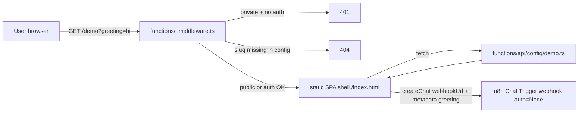

# Plan: Self-hosted embedded n8n chat page with dynamic greeting

## Solution approach

A Next.js 15 + TypeScript + Tailwind app built with `output: 'export'` and deployed to Cloudflare Pages. Because slug→workflow mapping is a runtime env var (no rebuild on change), we do **not** use Next.js dynamic route file conventions for `/[slug]`. Instead:

- A single client-rendered page reads `window.location.pathname` to extract the slug, fetches `/api/config/<slug>` from a Cloudflare Pages Function, then mounts `@n8n/chat` with `webhookUrl` + `metadata.greeting`.
- A `_redirects` rule (`/* /index.html 200`) makes Cloudflare Pages serve the SPA shell for any path so client-side routing works.
- A Cloudflare Pages **Function middleware** (`functions/_middleware.ts`) runs before static asset serving on every request. It:
  1. Lets static asset paths (`/_next/...`, `/favicon.ico`, `/api/...`) pass through (delegating to the next layer).
  2. Parses `SLUG_CONFIG` from `env`, extracts the slug from `URL.pathname`.
  3. Returns `404` if slug is unknown, or `/` is requested.
  4. If slug is `private: true`, validates the `Authorization: Basic` header against `BASIC_AUTH_USER` / `BASIC_AUTH_PASSWORD` env vars; returns `401` with `WWW-Authenticate: Basic realm="chat"` if invalid.
  5. Otherwise calls `next()` to serve the static SPA shell.
- A Cloudflare Pages Function `functions/api/config/[slug].ts` returns `{ webhookUrl, defaultGreeting }` for a slug (consulted by the client to build the createChat call). It does not return the `private` flag (already enforced upstream by middleware).



This shape:

- Keeps slug config 100% runtime (edit `SLUG_CONFIG` in Cloudflare dashboard → effective on next request).
- Makes the public/private boundary an explicit middleware decision, easy to unit test.
- Keeps all pure logic (config parsing, greeting resolution, slug→config lookup, public/private decision) in a `lib/` folder for fast unit tests with no Cloudflare runtime needed.

## Ordered steps

### 1. Scaffold the repo

**Files / systems:**
- `~/DEV/n8n-embedded-chat-host/` initialized as a new git repo.
- `package.json`, `tsconfig.json`, `next.config.ts` (with `output: 'export'`, `trailingSlash: false`, `images: { unoptimized: true }`).
- `tailwind.config.ts`, `postcss.config.js`, `app/globals.css` (Tailwind directives + import `@n8n/chat/dist/style.css`).
- `app/layout.tsx`, `app/page.tsx` (the client shell).
- `.gitignore`, `.eslintrc.json`, `.editorconfig`, `README.md`.
- Mirror baseline conventions from `~/DEV/ava-music` (Next 15, React 18, ESLint config-next), but switch to pnpm (project default in your environment) — note: ava-music uses npm; we'll deliberately use pnpm here.

**Verification:**
- `pnpm install` succeeds.
- `pnpm build` produces an `out/` directory containing `index.html` and `_next/static/...`.
- `pnpm lint` passes.
- `pnpm tsc --noEmit` passes.

### 2. Implement pure logic in `lib/` (test-first)

**Files:**
- `lib/config.ts` — `parseSlugConfig(raw: string): SlugConfigMap` + `getSlugConfig(map, slug): SlugEntry | null`. Types: `SlugEntry = { webhookUrl: string; defaultGreeting: string; private: boolean }`. Default `private` to `false` when omitted, default `defaultGreeting` to `""`.
- `lib/greeting.ts` — `resolveGreeting(urlParam: string | null | undefined, defaultGreeting: string): string`. Returns `urlParam` if non-empty, else `defaultGreeting`.
- `lib/auth.ts` — `parseBasicAuth(header: string | null): { user: string; pass: string } | null` + `isAuthorized(header, expectedUser, expectedPass): boolean` (using a timing-safe compare).
- `lib/slug.ts` — `extractSlug(pathname: string): string | null`. Returns first path segment, or `null` for `/` or paths with multiple segments not matching a single slug.

**Tests (`lib/*.test.ts`, vitest):**
- `parseSlugConfig` parses valid JSON, throws/returns empty map on invalid JSON, fills in defaults for missing optional fields.
- `getSlugConfig` returns null for unknown slug.
- `resolveGreeting`:
  - URL param `"hi"` + default `"hello"` → `"hi"`.
  - URL param `""` + default `"hello"` → `"hello"`.
  - URL param `null` + default `"hello"` → `"hello"`.
  - URL param `null` + default `""` → `""`.
- `parseBasicAuth` decodes valid header, returns null on malformed/missing.
- `isAuthorized` true with matching creds, false otherwise, false on missing header.
- `extractSlug` for `"/demo"` → `"demo"`, `"/"` → `null`, `"/demo/extra"` → `null`, `"/_next/static/x"` filtered upstream not here.

**Verification:**
- `pnpm test` (vitest) passes.
- Coverage on `lib/*.ts` ≥ 90% per file.

### 3. Build the client shell

**Files:**
- `app/page.tsx` — `'use client'` component. On mount: reads `window.location.pathname`, extracts slug via `lib/slug`. If null → render `<NotFound />`. Else fetches `/api/config/<slug>` → if `404` → `<NotFound />`. Else reads `new URLSearchParams(window.location.search).get('greeting')`, computes effective greeting via `lib/greeting`, calls `createChat({ webhookUrl, metadata: { greeting } })` on a target div.
- `app/not-found.tsx` — minimal 404 page (centered text).
- `components/ChatMount.tsx` — encapsulates the createChat call (so it can be swapped/mocked).
- Tailwind classes for centered, neutral background matching n8n hosted chat (`min-h-screen flex items-center justify-center bg-[#f4f6f8]` or similar — match by inspecting the current hosted chat page once accessible).

**Verification:**
- `pnpm build` succeeds with the new components.
- `pnpm dev` locally: visit `http://localhost:3000/demo` with a mocked `/api/config/demo` (use a dev-only fallback that reads from a `.env.local` JSON) → widget appears, greeting metadata visible in network panel of subsequent `sendMessage` requests.
- Visual check: page matches hosted chat layout closely on desktop and at 375px width.

### 4. Cloudflare Pages Functions

**Files:**
- `functions/_middleware.ts` — `onRequest(context)`. Steps:
  1. `const url = new URL(context.request.url)`.
  2. If pathname starts with `/_next/`, `/api/`, `/favicon`, or is a static-asset extension → `return context.next()`.
  3. Parse `context.env.SLUG_CONFIG` (memoize per worker instance).
  4. `const slug = extractSlug(url.pathname)`. If null and pathname is `/` → return 404. If slug not in map → return 404.
  5. If entry `private` → check `Authorization` header via `isAuthorized(..., env.BASIC_AUTH_USER, env.BASIC_AUTH_PASSWORD)`; if not → return 401 with `WWW-Authenticate: Basic realm="chat"`.
  6. `return context.next()`.
- `functions/api/config/[slug].ts` — `onRequestGet({ params, env })`. Parses `SLUG_CONFIG`, looks up `params.slug`. Returns `{ webhookUrl, defaultGreeting }` as JSON, or 404 if absent. (The middleware has already enforced auth on private slugs; the config endpoint itself is non-sensitive once that gate passes, but we still call it from inside a gated path so the same middleware protects it.)
- `public/_redirects` — `/*  /index.html  200` so Cloudflare Pages falls back to the SPA shell for any non-asset path.

**Verification (local with `wrangler pages dev`):**
- `npx wrangler pages dev out --binding SLUG_CONFIG='{"pub":{"webhookUrl":"https://example/x","defaultGreeting":"hi"},"sec":{"webhookUrl":"https://example/y","defaultGreeting":"yo","private":true}}' --binding BASIC_AUTH_USER=admin --binding BASIC_AUTH_PASSWORD=pw`
- `curl -i localhost:8788/` → 404.
- `curl -i localhost:8788/missing` → 404.
- `curl -i localhost:8788/pub` → 200, HTML shell.
- `curl -i localhost:8788/sec` → 401 with `WWW-Authenticate: Basic`.
- `curl -i -u admin:pw localhost:8788/sec` → 200.
- `curl -i localhost:8788/api/config/pub` → 200 JSON with `webhookUrl` and `defaultGreeting`, no `private` field.
- `curl -i localhost:8788/api/config/sec` → 401 without creds, 200 with creds.
- `curl -i localhost:8788/_next/static/<some-file>` → 200 without auth (asset bypass works).

### 5. Wire up GitHub + Cloudflare Pages

**Steps:**
- Create public GitHub repo `BerniWittmann/n8n-embedded-chat-host`. Push `main`.
- In Cloudflare dashboard: Pages → Create project → Connect to GitHub → select repo.
  - Build command: `pnpm install && pnpm build`.
  - Output directory: `out`.
  - Production env vars: `SLUG_CONFIG`, `BASIC_AUTH_USER`, `BASIC_AUTH_PASSWORD`.
  - Node version: 20.
- Add custom domain `chat.bernhardwittmann.com` in Pages → Custom domains. Cloudflare will create/verify the DNS record automatically since the zone is already on Cloudflare.

**Verification:**
- First push to `main` triggers a deploy that succeeds in the Cloudflare dashboard.
- `https://<project>.pages.dev/<public-slug>` returns the chat page.
- `https://chat.bernhardwittmann.com/<public-slug>` resolves and serves the same content.
- Same curl matrix from step 4 run against the live domain.

### 6. Migrate the existing workflow

**Steps in n8n (`vzXTteUPEAbSzHwk`):**
- Replace the existing Chat Trigger's mode from "Hosted Chat" to "Embedded Chat".
- Set Authentication = None on the Chat Trigger.
- Copy the new webhook URL.
- In the workflow body, read the greeting from the Chat Trigger output's metadata (`{{ $json.metadata.greeting }}`) and use it to construct the first response.
- Save and activate.

**Steps in Cloudflare:**
- Add a slug entry to `SLUG_CONFIG`, e.g.:
  ```json
  {
    "<chosen-slug>": {
      "webhookUrl": "https://berniwittmann.app.n8n.cloud/webhook/.../chat",
      "defaultGreeting": "<sensible default>",
      "private": false
    }
  }
  ```
- Save env var → next request picks it up.

**Verification:**
- `https://chat.bernhardwittmann.com/<slug>?greeting=hello` opens the widget; sending a message produces a workflow execution whose Chat Trigger output contains `metadata.greeting = "hello"`.
- `https://chat.bernhardwittmann.com/<slug>` (no param) → workflow execution shows `metadata.greeting = "<default>"`.
- The old hosted-chat URL is no longer needed.

### 7. README

**Files:**
- `README.md` — sections: overview, env var formats (with example JSON), local dev (`pnpm dev` + how to mock config), local Functions test (`wrangler pages dev`), Cloudflare Pages setup, custom domain, adding a new slug.

**Verification:**
- A reader unfamiliar with the project can: clone, install, run locally, deploy a new slug by editing one env var.

## Risks and open questions

- **`@n8n/chat` import shape under static export**: package ships ESM with bundled CSS. Importing inside a `'use client'` component should work fine, but we should confirm with a `pnpm build` that no SSR-time `window` access leaks. Mitigation: lazy-import via `await import('@n8n/chat')` inside the `useEffect`, which guarantees client-only evaluation.
- **Tailwind + n8n/chat style collisions**: Tailwind's preflight may reset elements the widget relies on. Scope the chat container so preflight doesn't strip widget styles; if there's bleeding, wrap the widget in a `.n8n-chat-host` div and use `corePlugins.preflight: false` for that subtree (or accept Tailwind preflight and trust @n8n/chat's own scoped styles, which is the more likely outcome).
- **Cloudflare Pages Function middleware ordering**: middleware runs *before* the static asset router, so the asset bypass list must be exhaustive enough to never block real assets. We will start with the conservative bypass list above and add to it if any 401s/404s show up for legitimate asset paths during the post-deploy curl matrix.
- **`SLUG_CONFIG` size limit**: Cloudflare env vars cap at ~5 KB per variable in the dashboard for Pages. Plenty for dozens of slugs but worth flagging if this grows. If we ever exceed it, fall back to a KV namespace.
- **Basic auth over HTTPS only**: enforced by Cloudflare TLS at the edge. Document that local `wrangler pages dev` uses HTTP so creds are visible in dev only.
- **Visual fidelity**: I haven't seen the current hosted chat page (it's behind your n8n basic auth). The plan assumes the background is a neutral light grey and the widget is centered. We may need a small follow-up tweak after eyeballing both side-by-side.
- **Single domain, single credentials pair**: with one global `BASIC_AUTH_USER` / `BASIC_AUTH_PASSWORD`, all private slugs share creds. If you ever want per-slug credentials, the config shape and middleware would need an extension (`auth: { user, pass }` per entry, or named credential sets referenced by ID).
- **`/api/*` not auth-bypassed for private slugs**: the middleware only sees the request path; `/api/config/<slug>` is implicitly public since it lives under `/api/`. That's intentional (the client needs `webhookUrl` to mount the widget *after* the middleware has already gated the page request). The webhook URL is not a secret beyond the auth gate already applied at the page level.
